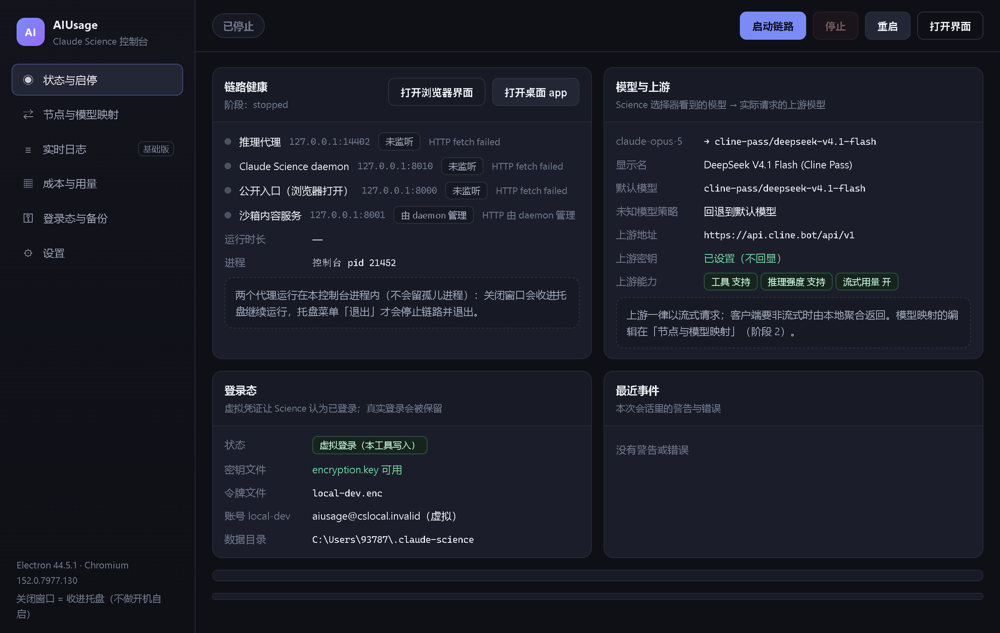
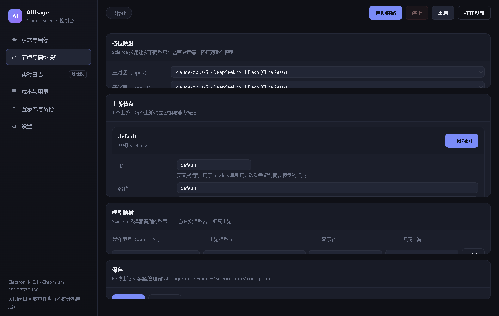

# Windows 版 Claude Science 代理（免 Claude 账号）


在 Windows 上无需 Claude 账号、无需订阅，把本地安装的 **Claude Science** 全链路接到你自己的
OpenAI Chat 兼容模型上：**登录态由本地伪造凭证获得，推理经本地代理转发到你自付的第三方端点**。

> 定位：个人学习与研究，使用者自负风险。推理不经过 Anthropic 服务端；登录用本地虚构账号。

## 下载安装（Releases）

到 [Releases](https://github.com/cjdem/AIUsage-Windows/releases) 下载：

| 文件 | 说明 |
|---|---|
| `AIUsage-Science-Proxy-<版本>-setup.exe` | NSIS 安装包（可自选安装目录，自动建桌面/开始菜单快捷方式） |
| `AIUsage-Science-Proxy-<版本>-portable.exe` | 免安装单文件，双击即用 |

前置条件：本机需已安装 Claude Science（默认 `%LOCALAPPDATA%\Programs\ClaudeScience\claude-science.exe`）。

**首次启动**会在 `%APPDATA%\aiusage-science-proxy\config.json` 生成配置模板——安装包里**不含任何密钥**，
把 `upstream.apiKey` / `upstream.baseURL` / `models` 换成你自己的即可；也可以直接在控制台的
「节点与模型映射」页里改并保存（密钥输入框留空＝保持原值，永不回显）。




---

## 0. 桌面控制台（Electron，阶段 1–6 已交付）

```powershell
cd tools\windows\science-proxy
npm install      # electron + electron-builder（都是 devDependency）
npm start        # 打开 AIUsage 风格的桌面控制台
npm run dist     # 可选：产出 NSIS 安装包 + 免安装版到 dist\
```

> 若 `npm install` 后 `node_modules\electron\dist\electron.exe` 不存在（Electron 二进制默认从 GitHub 下载，
> 国内网络常被阻断），用镜像补下载：
> `$env:ELECTRON_MIRROR='https://npmmirror.com/mirrors/electron/'; node node_modules\electron\install.js`
> 打包同理需要 `$env:ELECTRON_BUILDER_BINARIES_MIRROR='https://npmmirror.com/mirrors/electron-builder-binaries/'`；
> 本机若有 TLS 拦截代理还要临时 `$env:NODE_TLS_REJECT_UNAUTHORIZED='0'`（GitHub Actions 上都不需要）。

界面能力（六个模块全部可用）：

| 模块 | 能做什么 |
|---|---|
| 状态与启停 | 三端口实时探活、运行时长、进程号、模型与上游、登录态、启动阶段进度、最近错误、日志尾部；一键启动/停止/重启、打开浏览器界面、**打开桌面 app** |
| 节点与模型映射 | 增删改**多上游**（各自密钥与能力标记；密钥永不回显，留空=不改）、**档位映射**（主对话/子代理/辅助/未知 → 哪个模型）、模型映射增删改、**逐上游一键探测**（只走流式，给出能力标记建议）；保存前完整校验，失败时磁盘配置原样不动 |
| 实时日志 | 推理代理 + 会话反代 + Science daemon 输出汇聚（已脱敏），级别/来源过滤、跟随滚动 |
| 成本与用量 | 每次上游调用一条 JSONL（含真实 `cost` / `gateway_cost`、token、耗时、TTFT、工具调用数）；汇总 + 按天/按模型/按上游 + 最近调用 + 错误摘要 |
| 登录态与备份 | 登录态与令牌明细、写入/移除虚拟登录（检测到非本工具写入的凭证默认拒绝覆盖，需显式勾选强制）、备份列表 + 一键还原、**doctor**（9 项私有协议断言） |
| 设置 | 路径、端口、日志、行为约定、托盘与退出语义 |

启停走同一个编排层 `src/app-service.mjs`（阶段事件、统一回滚、残留清理）；
界面经 preload 暴露的窄 API 走 IPC，渲染进程 `contextIsolation + sandbox`、无 Node 权限、CSP `connect-src 'none'`。

**桌面 app 免登录（实测无需任何 hack）**：只要链路在跑，双击桌面图标的 Claude Science 会**附着**到我们已启动的
daemon（`auth-owner.lock` 指向它）、不另起实例，并用 daemon 自己发布的 Web UI（`http://localhost:8010/?nonce=…`）
打开窗口——窗口里就是这份已登录应用。界面上对应按钮是「打开桌面 app」。

> 关闭窗口 = **收进托盘**（链路继续跑；两个代理跑在本进程内，不会留孤儿进程）；托盘菜单「退出」才停链并退出。
> **不做开机自启**（按需求明确排除；托盘也不写注册表启动项）。

打包与 CI：

- `npm run dist` 产出 `dist\AIUsage Science Proxy-<版本>-setup.exe`（NSIS，可自选安装目录）与 `-portable.exe`（免安装）。
- 打包版把配置放在 `%APPDATA%\aiusage-science-proxy\config.json`（首次从内置 `config.example.json` 播种）：
  **安装包里不含任何真实密钥**，用户首次启动后自行填写。
- 本目录可**整体作为独立仓库根**（Windows 版独立发版）：随附的 `.gitignore` 已排除 `config.json`（真实密钥）、
  `node_modules`、`dist`；`docs/` 里带了两份设计/逆向文档，仓库自包含。
- GitHub Actions：`.github/workflows/build.yml`（手动触发 / 推送到 `main` / 打 `v*` 标签发布）。
  工作流自带护栏：若发现 `config.json` 被 git 跟踪会直接失败，防止真实密钥入库。

### 作为独立仓库首次发布

```powershell
cd tools\windows\science-proxy
git init -b main
git add .
git commit -m "Initial commit: AIUsage Science Proxy (Windows)"
git remote add origin https://github.com/<你的账号>/<仓库名>.git
git push -u origin main
git tag v0.3.0 && git push origin v0.3.0   # CI 跑测试 + 打包，并把安装包挂到 Release
```

## 1. 它由三层组成

```
浏览器 ──► http://localhost:8000        会话反代（自动注入 cookie，免点一次性链接）
              │
              ▼
         claude-science.exe serve        官方 daemon（独立内部端口 8010，沙箱内容 8001）
           env: ANTHROPIC_BASE_URL=http://127.0.0.1:14402
           data-dir: %USERPROFILE%\.claude-science
              │  POST /v1/messages（Anthropic 形状）
              ▼
         推理代理 127.0.0.1:14402          剥离入站凭证、注入你的上游 key、双向协议转换
           · GET  /v1/models               模型选择器的数据源（发布 Claude 形状 ID）
           · POST /v1/messages             Anthropic ⇄ OpenAI Chat（含流式与工具调用）
              ▼
         你的 OpenAI 兼容端点（chat/completions）
```

| 端口 | 用途 |
|---|---|
| 14402 | 推理代理（Science 的 `ANTHROPIC_BASE_URL` 指向这里） |
| 8000 | 公开入口（会话反代），浏览器就打开这个 |
| 8010 | daemon 内部端口（不对外） |
| 8001 | daemon 的沙箱内容端口（MCP app 用，保持默认） |

全部只监听 `127.0.0.1`。

---

## 2. 快速开始

前置：Node.js ≥ 20、已安装 Claude Science（默认 `%LOCALAPPDATA%\Programs\ClaudeScience\claude-science.exe`）。

```powershell
cd tools\windows\science-proxy
copy config.example.json config.json
# 编辑 config.json：填你的 upstream.baseURL / upstream.apiKey / models
node src/probe.mjs          # 先探测上游能力（会给出建议配置）
pwsh scripts\start.ps1      # 一键启动（自动备份 → 写虚拟登录 → 起三件套 → 打开浏览器）
pwsh scripts\status.ps1     # 查看状态
pwsh scripts\stop.ps1       # 停止
```

`start.ps1` 做的事：只读备份真实 data-dir → 确保登录态 → 清残留 → 起推理代理 →
以我们的 env 起 daemon → 等健康 → 起会话反代 → 自探后打开 `http://localhost:8000/`。

### config.json 关键字段

```jsonc
{
  "upstream": {
    "baseURL": "https://your-endpoint/v1",   // 不含 /chat/completions
    "apiKey": "sk-...",                      // 只存本地，config.json 已被 .gitignore 忽略
    "supportsTools": true,
    "supportsReasoningEffort": false         // 上游支持 reasoning_effort 时置 true
  },
  "models": [
    { "id": "你的真实模型名", "publishAs": "claude-opus-5", "displayName": "显示名" }
  ],
  "defaultModel": "你的真实模型名",
  "ports": { "inference": 14402, "publicEntry": 8000, "daemon": 8010, "sandbox": 8001 }
}
```

`publishAs` 建议用 Science 0.1.56 内置目录里的型号（`claude-opus-5` / `claude-sonnet-5` /
`claude-opus-4-8` / `claude-sonnet-4-6`），这样模型选择器、effort 控件、上下文上限都按对应家族显示。

---

## 3. 常用命令

```powershell
node src/probe.mjs                      # 上游能力探测 + 配置建议
node src/daemon-probe.mjs               # daemon 侧诊断（登录态、模型目录来源）
node src/virtual-login.mjs inspect      # 查看当前登录凭证（只读，给虚拟令牌回环解密校验）
node src/virtual-login.mjs write        # 写入虚拟登录（检测到真实登录会拒绝，除非 --force）
node src/virtual-login.mjs remove       # 仅删除本工具写入的虚拟令牌
node src/science-control.mjs backup     # 备份真实 data-dir 的凭据/状态文件
node src/science-control.mjs restore --from <备份目录>   # 还原
node src/science-control.mjs url        # 打印官方一次性登录链接（备用）
node --test "test/*.test.mjs"           # 全部单测 + 集成测试（mock 上游）
node src/app-service.mjs start          # 前台启动整条链（编排层；Ctrl+C 停止）
node src/app-service.mjs status         # 状态（JSON，供脚本消费）
node src/app-service.mjs stop           # 停止并清理残留
node src/app-service.mjs open           # 打开已登录的公开入口
```

---

## 4. 你的上游端点的注意事项（实测结论）

用 `probe.mjs` 在你的端点上实测得到（Cline 网关 `api.cline.bot`，套餐模型名 `cline-pass/deepseek-v4.1-flash`）：

> 本代理**始终以流式（`stream: true`）请求上游**：这类套餐网关的非流式接口会静默返回空内容，
> 流式接口才正常。客户端（Science）要非流式时，由本代理在本地把分片聚合成完整 JSON 返回，
> 因此没有开关，也不会向上游发非流式请求。

| 现象 | 结论 |
|---|---|
| **非流式接口不可用**：返回 200 但 `message.content` 为空，带 `system` 时 500 `empty response content` | 所以本代理一律以流式请求上游；非流式客户端由本地聚合。`probe.mjs` 也只测流式，避免误判成「不支持工具」 |
| 流式接口完全正常，含 `tool_calls` 与 `usage` | 工具调用是 Science 的主力用法（shell/python/skill），必须走流式 |
| `reasoning_effort` / `thinking` 在流式下被接受，模型会回 `reasoning_content` | 需要时可把 `supportsReasoningEffort` 置 `true` 透传 effort |
| `max_completion_tokens` 不支持 | 保持 `maxTokensField: "max_tokens"` |

Science 除了主对话，还会用 `claude-haiku-4-5-20251001` 发起辅助调用（标题/标注等）；
本代理默认把这些未知 Claude 形状型号回退到 `defaultModel`，不会漏打上游。

---

## 5. 排障

| 现象 | 原因 / 处置 |
|---|---|
| 浏览器打开 8000 显示 503/会话不可用 | nonce 铸取有启动竞态，反代会在后台每 5s 重试；等几秒刷新。仍不行看 `%LOCALAPPDATA%\ClaudeScience\aiusage-proxy\logs\session.log` |
| 对话报 "sign in with your Claude account" / agent `status=error` | 虚拟登录缺失或被删：`node src/virtual-login.mjs inspect`，必要时 `write` |
| 模型选择器显示默认型号并提示加载失败 | 推理代理没起或 `ANTHROPIC_BASE_URL` 没生效：确认 14402 的 `/health`，并重启 daemon |
| 上游 401 | `config.json` 里 `upstream.apiKey` 失效（`probe.mjs` 会先报出来） |
| 回复为空 | 正常不该出现：本代理一律流式调上游。若出现，查看 `inference.log` 的 `json-fallback`/`(aggregated)` 记录与上游正文摘要 |
| 写操作 403 `origin_required` | 直接打 daemon（不经反代）时才会出现；反代会自动补 Origin |
| 端口占用 | `8000/8001/8010/14402` 任一被占都会明确报错；先 `pwsh scripts\stop.ps1` |
| 想恢复原状 | `node src/science-control.mjs restore --from <备份目录>`；备份由 `start.ps1` 自动创建 |

---

## 6. 安全边界（代码里硬编码的护栏）

- 只监听回环；入站 `Authorization` / `x-api-key` **一律剥离**，上游 key 只在本进程内存。
- 虚拟登录只写 `%USERPROFILE%\.claude-science\.oauth-tokens\<user>.enc`：
  - 检测到真实 Claude 登录时**拒绝覆盖**（需显式 `--force`）；
  - 写前拒符号链接；`tmp + rename` + `0600`；
  - `remove` 只删带 `aiusage_virtual` 标记的文件。
- 不写系统环境变量（env 只作用于 `start.ps1` 派生的子进程）；不修改 Science 二进制。
- 启动前自动只读备份真实 data-dir 的凭据/状态文件；密钥/令牌/Cookie 打码后才进日志。
- `config.json`（含上游密钥）已被 `.gitignore` 忽略。

---

## 7. 已知限制

1. **只做到浏览器路径**：双击桌面图标仍会走它自己的真实实例（桌面 app 免登录是下一步工作）。
2. 需要本机已安装 Claude Science；版本变化可能影响私有协议（nonce 接口、CSRF、令牌格式），
   相关实现都集中在 `src/science-control.mjs` / `src/virtual-login.mjs`，便于按版本修补。
3. Anthropic 托管的远程 MCP、云端同步等功能在虚拟登录下不可用；本地内置 MCP 与本地技能正常。
4. 首次启动 daemon 会预装 conda/MCP 环境（可能几分钟），期间工具未就绪属正常。
5. 桌面控制台默认常驻托盘：关闭窗口只是收进托盘（链路继续跑），托盘菜单「退出」才停链并退出；应用退出时两个代理随进程结束，不会留孤儿进程。

详细技术与逆向结论见 [`docs/WINDOWS_SCIENCE_PROXY.md`](docs/WINDOWS_SCIENCE_PROXY.md)。

分阶段规划与实施状态见 [`docs/WINDOWS_SCIENCE_APP_ROADMAP.md`](docs/WINDOWS_SCIENCE_APP_ROADMAP.md)。

### 发版流程（下次更新时）

```powershell
# 1) 改 package.json 里的 version（例如 0.3.1）
# 2) 提交推送
git add -A; git commit -m "Release 0.3.1"; git push
# 3) 打同名标签 -> CI 自动跑测试、打包，并把安装包挂到该标签的 Release
git tag v0.3.1; git push origin v0.3.1
```

注意：`tools/windows/science-proxy` 是**独立仓库**（`cjdem/AIUsage-Windows`），与 macOS 那份
`cjdem/AIUsage` 互不影响；两个仓库各自打各自的标签。